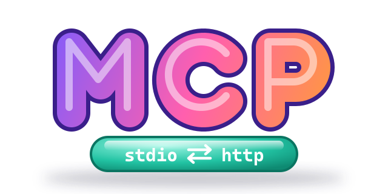
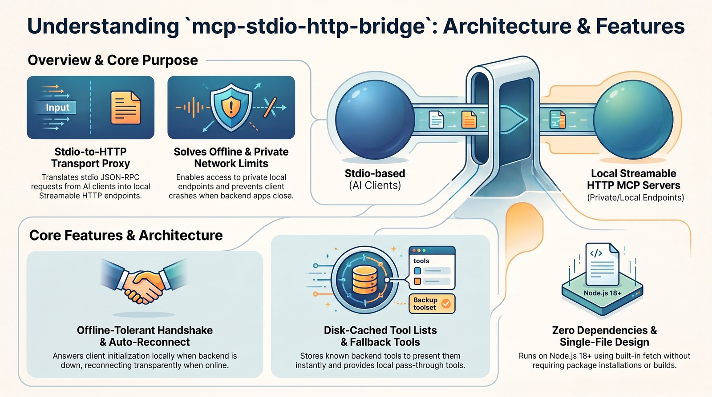

<p align="center">
  
</p>

# mcp-stdio-http-bridge

A zero-dependency Node.js bridge that exposes any **MCP Streamable HTTP** server as a local **stdio** MCP server. It is a single file, offline-tolerant, and caches the backend's tool list.

```
┌──────────────────────┐  stdio (JSON-RPC)  ┌───────────────────────────┐  HTTP / SSE  ┌──────────────────────────┐
│ MCP client           │ ◄────────────────► │ mcp-stdio-http-bridge.mjs │ ◄──────────► │ Local / private HTTP MCP │
│ Claude Desktop,      │                    │ (spawned by the client)   │              │ server (127.0.0.1, LAN…) │
│ Cowork, Claude Code, │                    └───────────────────────────┘              │ IDA, x64dbg, x32dbg, …   │
│ Codex…               │                                                               └──────────────────────────┘
└──────────────────────┘
```

---

## Why this exists

Claude Code supports direct connections to MCP servers over both HTTP and stdio. Claude Cowork and Claude.ai also support remote HTTP MCP servers, but Anthropic's cloud infrastructure routes those connections, so the endpoints generally have to be publicly reachable.

Locally hosted or private-network HTTP MCP servers run into that limit. A debugger plugin on `127.0.0.1` (x64dbg/x32dbg), a disassembler's MCP endpoint (IDA, Malcat, …), or an internal service on the LAN can't be reached from the cloud, so you can't add it as a remote connector.

This bridge works around the limit with a local proxy that translates between stdio and HTTP MCP transports. The client launches it as an ordinary local stdio server (for example from `claude_desktop_config.json`), and it relays every JSON-RPC message to the HTTP endpoint on your machine or network. Any client that supports local stdio connections can then use a compatible HTTP MCP server.

Local HTTP MCP servers have a second problem: **they are often not running.** A debugger or analysis tool usually exposes its MCP endpoint only while the application is open. A plain proxy fails the MCP handshake in that case, the client shows a "Couldn't start / failed to connect" error, and the tools stay missing for the whole session. This bridge is designed around that case (see [How it works](#how-it-works)).

<p align="center">
  
</p>

## Features

- **Local HTTP MCP servers in any stdio client.** Use local or private-network HTTP MCP servers from Claude Desktop, Cowork, Claude Code, Codex or any other client that can launch a stdio server. No public endpoint is needed.
- **stdio ⇄ Streamable HTTP relay** with JSON and SSE (`text/event-stream`) responses, batched JSON-RPC replies, and `Mcp-Session-Id` tracking. The client's own `initialize` parameters (protocol version, capabilities, client info) are forwarded to the backend.
- **No client restarts (offline-tolerant handshake).** If the backend is down, the bridge answers `initialize` itself, so the client never shows a startup error. You can start Claude or Codex first and open IDA or x64dbg/x32dbg whenever you need them; the bridge connects on its own. Closing and reopening the tool also works.
- **Automatic reconnect.** A background probe and a lazy reconnect on every request reconnect the bridge. It also re-initializes transparently when the backend restarts (HTTP 404/400 on a stale session).
- **Tool-list cache on disk.** The last known backend tools are served while the backend is offline, so they are visible from the start of the session, even in clients that read the tool list only once.
- **Always a fallback.** The pass-through tools (`<prefix>_status`, `<prefix>_list_tools`, `<prefix>_call`) reach every backend tool even when the client's tool list is stale.
- **Optional auth header**, such as `"Authorization: Bearer <token>"`, or any other `Name: Value` header.
- **Zero dependencies.** It is a single `.mjs` file with no `npm install` and no build step. It needs only Node.js 18+ (built-in `fetch`).

## Requirements

- **Node.js 18 or newer** (`node --version`)
- An MCP server that speaks **Streamable HTTP** (POST JSON-RPC, JSON or SSE replies). The legacy HTTP+SSE transport (separate `GET /sse` endpoint) is not supported.

## Installation

1. **Get the script.** Clone the repository or download the single file:

   ```bash
   git clone https://github.com/jumpifequal/mcp-stdio-http-bridge.git
   ```

   Put it in a stable folder, because the client config will reference its absolute path, for example `C:\Tools\mcp-bridge\mcp-stdio-http-bridge.mjs` or `~/tools/mcp-bridge/mcp-stdio-http-bridge.mjs`.

2. **Test it by hand (optional).** Start your HTTP MCP server (e.g. open x64dbg with the MCP plugin loaded), then run:

   ```bash
   node mcp-stdio-http-bridge.mjs http://127.0.0.1:9094/ "Authorization: Bearer <YOUR_TOKEN>"
   ```

   You should see `[mcp-stdio-http-bridge] bridging stdio <-> http://127.0.0.1:9094/ …` on stderr. The bridge reads one JSON-RPC message per line from stdin, so you can paste these lines one at a time to simulate a client:

   ```json
   {"jsonrpc":"2.0","id":1,"method":"initialize","params":{"protocolVersion":"2025-06-18","capabilities":{},"clientInfo":{"name":"manual","version":"0"}}}
   {"jsonrpc":"2.0","method":"notifications/initialized"}
   {"jsonrpc":"2.0","id":2,"method":"tools/list"}
   ```

   The `tools/list` reply should contain the backend tools plus the three local `bridge_*` tools. Press `Ctrl+C` to exit.

3. **Register it in your client.** See below.

### Claude Desktop / Cowork

Edit `claude_desktop_config.json`:

| OS | Location |
|---|---|
| Windows | `%APPDATA%\Claude\claude_desktop_config.json` |
| macOS | `~/Library/Application Support/Claude/claude_desktop_config.json` |

Add one entry per backend under `mcpServers`. Each entry runs its own bridge process. The example below wires up three real servers:

- **x64dbg** and **x32dbg**, through the x64dbg MCP plugin. It listens on loopback only while the debugger is open, on a separate port for each architecture, with token auth.
- **alphaXiv**, a remote HTTPS MCP server with an API key. The bridge works with any reachable HTTP(S) endpoint, not only loopback.

```json
{
  "mcpServers": {
    "x64dbg": {
      "command": "node",
      "args": [
        "C:\\Tools\\mcp-bridge\\mcp-stdio-http-bridge.mjs",
        "http://127.0.0.1:9094/",
        "Authorization: Bearer <YOUR_X64DBG_TOKEN>"
      ],
      "env": {
        "BRIDGE_PROBE_MS": "5000",
        "BRIDGE_CONNECT_MS": "3000",
        "BRIDGE_STATUS_TOOL": "x64dbg_status"
      }
    },
    "x32dbg": {
      "command": "node",
      "args": [
        "C:\\Tools\\mcp-bridge\\mcp-stdio-http-bridge.mjs",
        "http://127.0.0.1:9095/",
        "Authorization: Bearer <YOUR_X32DBG_TOKEN>"
      ],
      "env": {
        "BRIDGE_STATUS_TOOL": "x32dbg_status"
      }
    },
    "alphaXiv": {
      "command": "node",
      "args": [
        "C:\\Tools\\mcp-bridge\\mcp-stdio-http-bridge.mjs",
        "https://api.alphaxiv.org/mcp/v1",
        "Authorization: Bearer <YOUR_ALPHAXIV_API_KEY>"
      ],
      "env": {
        "BRIDGE_STATUS_TOOL": "alphaxiv_status"
      }
    }
  }
}
```

With these settings, the model sees the backend tools plus `x64dbg_status` / `x64dbg_list_tools` / `x64dbg_call`, and the same set for `x32dbg_*` and `alphaxiv_*`.

Then **quit Claude Desktop completely**, including the system-tray or menu-bar icon, and start it again. Open a new conversation or Cowork session.

### Claude Code

Claude Code can connect to HTTP servers natively (`claude mcp add --transport http …`). Using the bridge still helps if you want the offline tolerance and the tool cache:

```bash
claude mcp add x64dbg -e BRIDGE_STATUS_TOOL=x64dbg_status -- node /path/to/mcp-stdio-http-bridge.mjs http://127.0.0.1:9094/ "Authorization: Bearer <YOUR_X64DBG_TOKEN>"
```

### Codex

Codex CLI reads stdio MCP servers from `~/.codex/config.toml` (Windows: `%USERPROFILE%\.codex\config.toml`):

```toml
[mcp_servers.x64dbg]
command = "node"
args = ['C:\Tools\mcp-bridge\mcp-stdio-http-bridge.mjs', "http://127.0.0.1:9094/", "Authorization: Bearer <YOUR_X64DBG_TOKEN>"]
env = { BRIDGE_STATUS_TOOL = "x64dbg_status" }
```

Single quotes make the Windows path a TOML literal string, so the backslashes don't need escaping.

### Other clients

Any client that can launch a stdio MCP server works. The command is always:

```
node <path>/mcp-stdio-http-bridge.mjs <url> ["<HeaderName>: <HeaderValue>"]
```

## Configuration

**Command-line arguments**

| Position | Required | Meaning |
|---|---|---|
| 1 | yes | Backend URL, e.g. `http://127.0.0.1:9094/` or `https://api.alphaxiv.org/mcp/v1` |
| 2 | no | One extra HTTP header as `"Name: Value"`, e.g. `"Authorization: Bearer abc123"`. It is split at the **first** `:`, so values may contain colons. It is sent on every request to the backend. |

**Environment variables** (the `"env"` block in the JSON config; values are strings)

| Variable | Default | Meaning |
|---|---|---|
| `BRIDGE_PROBE_MS` | `5000` | Reconnect probe interval while the backend is offline (`0` = no background probe; reconnects only on demand) |
| `BRIDGE_CONNECT_MS` | `3000` | Timeout of a single connect/initialize attempt |
| `BRIDGE_STATUS_TOOL` | `bridge_status` | Name of the local status tool (`""` = none). Also sets the prefix of the other local tools |
| `BRIDGE_TOOL_PREFIX` | derived from the status tool | Overrides the prefix for `<prefix>_call` / `<prefix>_list_tools` |
| `BRIDGE_CACHE_DIR` | `.bridge-cache` next to the script | Where the tool-list cache is stored |

> **Tip:** If you run several bridges, give each one a distinct `BRIDGE_STATUS_TOOL` (e.g. `x64dbg_status`, `x32dbg_status`). Otherwise every server exposes tools with the same names (`bridge_status`, `bridge_call`, …) and the model can't tell them apart. If a backend tool happens to have the same name as a local tool, the local one wins and the backend tool is hidden.

## How it works

### 1. Offline-tolerant handshake

**Why it matters: you never have to restart Claude or Codex just because a local MCP server was down.** MCP clients launch their servers once, when they start. If IDA, x64dbg or x32dbg isn't open at that moment, a plain proxy fails, and normally the only fix is to open the tool and then restart the whole client process. With the bridge, you can start Claude or Codex first and open IDA or x64dbg/x32dbg whenever you need them. The bridge notices that the backend is up and the client picks up the tools without a restart. The same applies if you close the debugger and open it again later.

When the client sends `initialize`, the bridge tries to reach the backend within `BRIDGE_CONNECT_MS`:

- **Backend online.** The bridge forwards the handshake and returns the backend's real `initialize` result, with `tools.listChanged: true` added.
- **Backend offline.** The bridge answers `initialize` itself and includes a short `instructions` note saying the backend is offline. The client registers the server successfully, so you get no startup error. A background probe then runs every `BRIDGE_PROBE_MS`.

While offline, the bridge answers locally: `ping` succeeds, `tools/list` returns the cached tools plus the local tools, `resources/list`, `resources/templates/list` and `prompts/list` return empty lists, and `tools/call` returns the `OFFLINE` status as a tool error. Any other request gets a JSON-RPC error (`-32001`) with the same status text. Every incoming request also triggers a lazy reconnect attempt first (bounded by `BRIDGE_CONNECT_MS`), so the bridge often comes back online before the probe fires.

When the backend comes up, the bridge performs the real handshake and sends `notifications/tools/list_changed`, so clients that support it re-fetch the tool list. If the backend later disappears, tool calls return a **tool-level** error (`isError: true`, text starting with `OFFLINE: …`) instead of breaking the connection. The probe also restarts.

### 2. Backend restarts

When a backend restarts, it forgets its old `Mcp-Session-Id` and replies with HTTP 404/400. The bridge detects this, re-initializes a new session, and retries the request once. You don't see anything happen.

### 3. Tool-list cache: the key trick

Some clients read `tools/list` **only once** at session start and ignore `notifications/tools/list_changed`. Cowork's device proxy is one of them. Without a workaround, a session started before the backend app was opened would never see the backend's tools.

To avoid that, the bridge saves every tool list it receives to `.bridge-cache/<url>.tools.json`, where every non-alphanumeric run in the URL becomes `_` (e.g. `http://127.0.0.1:9094/` → `http_127_0_0_1_9094_.tools.json`). The cache is refreshed on every successful connection and every `tools/list`. While the backend is offline, `tools/list` returns the **cached** list. The real tools are therefore visible from the first moment of the session, even if the app isn't running yet. When one of them is called, the bridge connects lazily. If the backend is up by then, the call succeeds. If not, it returns a clear `OFFLINE` message.

➡️ **Run each backend once with the bridge connected** so the cache is populated. After that, start order no longer matters.

### 4. Local pass-through tools

Every bridge also exposes three local tools, named after the prefix:

| Tool | What it does |
|---|---|
| `<prefix>_status` | Reports whether the backend is reachable and forces an immediate reconnect attempt |
| `<prefix>_list_tools` | Returns the backend's **live** tool list (name, description, schema) and refreshes the cache |
| `<prefix>_call` | Invokes any backend tool by name: `{ "tool": "<name>", "arguments": { … } }` |

`_list_tools` and `_call` are the safety net. Even when the client's tool list is empty or stale, for example because a new backend version added tools, the model can discover and call every backend tool through them without a new session.

## Tips & tricks

- **Populate the cache first.** Open the target application once while the client is running, or call `<prefix>_list_tools`. From then on, its tools appear in every new session.
- **Tools missing in a running session?** Ask the model to call `<prefix>_status`, then `<prefix>_list_tools` / `<prefix>_call`. Or start a new session once the cache exists.
- **Backend upgraded or tools changed?** Delete the `.bridge-cache` folder, or the single `*.tools.json` file, to reset the cache. It is rebuilt on the next connection.
- **Cache folder must be writable.** By default `.bridge-cache` is created next to the script. If the script lives in a read-only location (e.g. `Program Files`), set `BRIDGE_CACHE_DIR` to a writable folder. A failed write is only logged; the bridge keeps working without a cache.
- **`node` not found?** GUI apps often don't inherit your shell's `PATH`. Use the absolute path to Node, e.g. `"C:\\Program Files\\nodejs\\node.exe"` or `/usr/local/bin/node`.
- **Windows paths in JSON** need doubled backslashes: `"C:\\Tools\\mcp-bridge\\mcp-stdio-http-bridge.mjs"`.
- **Always fully quit** Claude Desktop, including the tray icon, after editing the config. Closing the window is not enough.
- **Per-tool approval:** the client asks you to approve each backend tool individually. The bridge can't change this.
- **Several backends:** add one `mcpServers` entry per backend, each with its own URL and prefix. They run as independent processes and share the cache folder safely, because each uses its own file.

## Troubleshooting

| Symptom | What to check |
|---|---|
| Server shows "failed" in the client | Run the command by hand (step 2 of the installation). Check the Node path and version (≥ 18) and the script path. |
| Tools never appear | The cache is empty and the client ignores `list_changed`. Start the backend, call `<prefix>_list_tools`, then open a new session. |
| Every call returns `OFFLINE: … connection refused` | The backend isn't listening on that host and port. Check the URL, including the trailing `/` or `/mcp` path. |
| `HTTP 401/403 from backend` | Wrong or missing auth header or token. |
| `HTTP 404` on every call | Wrong endpoint path, or the server uses the legacy SSE transport. |

**Logs.** The bridge writes to stderr with the prefix `[mcp-stdio-http-bridge]`. Claude Desktop stores them at:

- Windows: `%APPDATA%\Claude\logs\mcp-server-<name>.log`
- macOS: `~/Library/Logs/Claude/mcp-server-<name>.log`

## Limitations

- One extra HTTP header only. OAuth flows are not supported (static tokens only).
- Only the client → server direction is relayed, including server responses and SSE streams on POST. The standalone `GET` SSE stream for unsolicited server-to-client messages is not opened. As a result, server-initiated requests (sampling, elicitation, roots) and notifications sent outside a POST response don't reach the client.
- The bridge doesn't send an HTTP `DELETE` to end the session when it exits. The backend expires the session on its own.
- Only the Streamable HTTP transport is supported, not the legacy HTTP+SSE transport.

## Security notes

- The bridge is meant for **loopback or trusted private networks**. Any process on the host can reach an unauthenticated loopback MCP endpoint, so use token auth wherever the backend supports it.
- `claude_desktop_config.json` stores Bearer tokens **in clear text**. Never commit or share it; share a copy with placeholders instead.
- The bridge logs only the header **name**, never its value.
- The cache files hold only tool names, descriptions and schemas. They never contain call arguments or results.
- Tools exposed by debuggers, disassemblers and similar software can execute code or modify processes. Analyze untrusted samples only inside an isolated VM.

## License

Licensed under the [Apache License 2.0](LICENSE).
